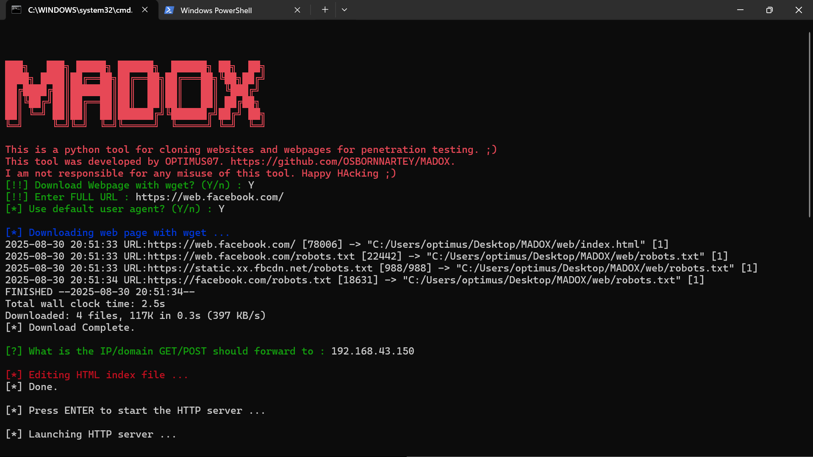
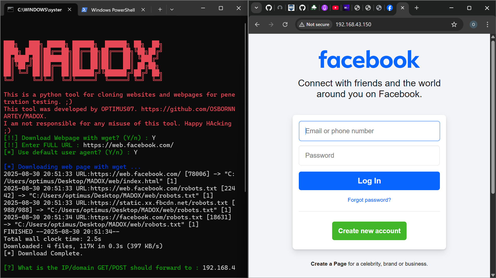

# MADOX
<p align="center">
  
</p>

MADOX is a Python-based penetration testing tool for cloning websites and capturing form submissions.  
It allows security researchers to simulate phishing scenarios and analyze web application behavior.

<p align="center">
  
</p>

> ⚠️ **Disclaimer:** This tool is developed strictly for educational and ethical penetration testing purposes.  
> Unauthorized use against systems you don’t own or have explicit permission to test is illegal.  
> The author is not responsible for any misuse of this tool.

---

## ✨ Features
- Interactive ASCII-art intro with typing effect.
- Clone entire websites using `wget`.
- Modify HTML form actions to redirect captured data.
- Custom HTTP server to handle GET/POST requests.
- Logs POST request data into `post.txt`.
- Supports custom user-agents.

---

## 📂 Project Structure
```
madox.py          # Main tool
web/              # Cloned websites will be stored here
post.txt          # Captured form submissions
```

---

## ⚙️ Installation

1. Clone the repository:
   ```bash
   git clone https://github.com/OSBORNNARTEY/MADOX.git
   cd MADOX
   ```

2. Install dependencies:
   ```bash
   pip install colorama termcolor
   ```

3. Make sure `wget` is installed:
   ```bash
   sudo apt-get install wget   # Linux (Debian/Ubuntu)
   brew install wget           # macOS (Homebrew)
   ```

---

## 🚀 Usage

Run the script with Python:

```bash
python3 madox.py
```

Steps:
1. Choose whether to download a webpage using `wget`.
2. Enter the target URL.
3. Decide on a custom User-Agent (or use default).
4. Provide a redirect IP/domain for GET/POST forwarding.
5. Launch the HTTP server to serve cloned pages.

Captured POST requests will be saved in `post.txt`.

---

## 🛠️ Example Workflow

1. Download a target webpage:
   ```
   [!!] Download Webpage with wget? (Y/n): Y
   [!!] Enter FULL URL: http://example.com
   ```

2. Start the HTTP server and wait for victim interactions.

3. All form submissions will be logged in `post.txt`.

---

## 🔧 Cleanup
After finishing, make sure to clean up the environment by removing or resetting cloned files.

---

## 👨‍💻 Author
Developed by **Optimus07**  
🔗 GitHub: [OSBORNNARTEY](https://github.com/OSBORNNARTEY)

---

## 📜 License
This project is licensed under the MIT License.
